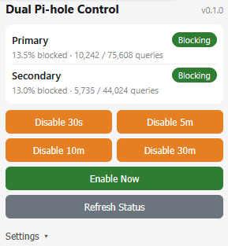

# dual-pihole-control

**Version: v0.1.0**

One-click control of **two Pi-hole servers at once** from a Firefox browser
extension. Click a button in your browser to disable blocking on both your
Primary and Secondary Pi-hole for a chosen duration — no more logging into two
admin dashboards.



> Replace the image above with a real screenshot of the extension popup.
> See `docs/images/README.md` for what to capture.

## Documentation

- **[QUICKSTART.md](QUICKSTART.md)** — fastest path to a working setup.
- **[docs/INSTALL.md](docs/INSTALL.md)** — detailed install (Windows, Linux, macOS).
- **[docs/USAGE.md](docs/USAGE.md)** — using the extension day to day.
- **[docs/PUBLISH-EXTENSION.md](docs/PUBLISH-EXTENSION.md)** — packaging and
  publishing the extension to addons.mozilla.org.
- **[FAQ.md](FAQ.md)** — common questions.
- This README — full reference, API, troubleshooting, security.

## How it works

```
Firefox extension  ──HTTP──▶  Backend (Docker, Windows 10)  ──HTTP──▶  Pi-hole #1
   (popup UI)                  Node.js + Express                       Pi-hole #2
```

- The **browser extension** stores only the **backend URL** and a **control
  token**. It never sees Pi-hole passwords.
- The **backend service** holds the Pi-hole passwords (in `.env`), authenticates
  to each Pi-hole, and calls the official Pi-hole API.
- Designed for **LAN / private use only**. Do **not** expose the backend to the
  public internet.

## Architecture notes

- **Pi-hole v6 REST API** is the primary target (`/api/auth`,
  `/api/dns/blocking`). A compatibility layer in `src/piholeClient.js` leaves
  room for Pi-hole v5 (set `PIHOLE_<n>_API_VERSION=5`).
- The extension uses **Manifest V3** and a `browserApi.js` wrapper so **Chrome
  support can be added later** with minimal changes (mainly a manifest tweak).
- More than two Pi-holes are supported — just add `PIHOLE_3_*`, `PIHOLE_4_*`,
  etc. to `.env`.

## Project layout

```
dual-pihole-control/
├── README.md
├── docker-compose.yml
├── Dockerfile
├── package.json
├── .env.example
├── .gitignore
├── src/
│   ├── server.js            Express app entry point
│   ├── config.js            Loads/validates env vars
│   ├── piholeClient.js      PiHoleClient class (v6 + v5 compat)
│   ├── routes.js            API endpoints
│   └── middleware/
│       ├── auth.js          Bearer-token auth
│       └── rateLimit.js     Rate limiting
└── extension/
    └── firefox/
        ├── manifest.json
        ├── popup.html
        ├── popup.js
        ├── popup.css
        └── browserApi.js    Cross-browser API wrapper
```

---

## Setup on Windows 10 (Docker Desktop)

> Requires **Docker Desktop for Windows** installed and running.

### 1. Create the project folder

Place all the files from this repository in a folder, for example:

```
C:\Users\You\dual-pihole-control
```

### 2. Copy the env file

In PowerShell, from the project folder:

```powershell
Copy-Item .env.example .env
```

### 3. Edit `.env`

Open `.env` in a text editor and set:

- `CONTROL_TOKEN` — a long random string. Generate one in PowerShell:

  ```powershell
  [Convert]::ToBase64String((1..32 | ForEach-Object {Get-Random -Max 256}))
  ```

- `PIHOLE_1_BASE_URL` / `PIHOLE_1_PASSWORD` — your Primary Pi-hole's LAN IP
  (e.g. `http://192.168.1.10`) and admin password.
- `PIHOLE_2_BASE_URL` / `PIHOLE_2_PASSWORD` — your Secondary Pi-hole.

> Use real **LAN IP addresses**, not `127.0.0.1` — the backend runs inside a
> container and `127.0.0.1` would point at the container itself.

### 4. Start the backend

```powershell
docker compose up -d
```

This builds the image and starts the `dual-pihole-control` container.

### 5. Test backend health

```powershell
curl http://localhost:8088/health
```

Expected: JSON like
`{"ok":true,"service":"dual-pihole-control","piholes":[...]}` (no secrets).

### 6. Test the disable endpoint with curl

Replace `YOUR_TOKEN` with your `CONTROL_TOKEN`:

```powershell
curl -X POST http://localhost:8088/api/disable `
  -H "Authorization: Bearer YOUR_TOKEN" `
  -H "Content-Type: application/json" `
  -d '{\"seconds\":300}'
```

Expected: a JSON object with a `results` array showing each Pi-hole's outcome.
Re-enable with:

```powershell
curl -X POST http://localhost:8088/api/enable `
  -H "Authorization: Bearer YOUR_TOKEN"
```

### 7. Load the Firefox extension (temporary)

1. Open Firefox and go to `about:debugging`.
2. Click **This Firefox**.
3. Click **Load Temporary Add-on…**.
4. Select `extension/firefox/manifest.json`.

> Temporary add-ons are removed when Firefox restarts. That is fine for personal
> LAN use; reload it the same way after a restart.

### 8. Configure the extension

Click the extension's toolbar icon to open the popup, then:

1. Click **Settings**.
2. Set **Backend URL** to your server, e.g. `http://192.168.1.50:8088`
   (use the Windows server's LAN IP, not `localhost`, if you use the extension
   from another machine).
3. Set **Control Token** to the same `CONTROL_TOKEN` from `.env`.
4. Click **Save Settings**.

### 9. Test "Disable 5m"

Click **Disable 5m** in the popup. You should see a success (or partial
failure) message and updated status badges.

### 10. Verify on the Pi-hole dashboards

Open each Pi-hole admin dashboard. Both should show blocking **disabled** with a
countdown timer. Click **Enable Now** in the popup to turn blocking back on.

---

## Backend API reference

All `/api/*` endpoints require the header
`Authorization: Bearer <CONTROL_TOKEN>`.

| Method | Path           | Body                | Description                                  |
|--------|----------------|---------------------|----------------------------------------------|
| GET    | `/health`      | —                   | Service status, no secrets, no auth.         |
| GET    | `/api/status`  | —                   | Blocking status of every Pi-hole.            |
| POST   | `/api/disable` | `{ "seconds": 300 }`| Disable blocking on all Pi-holes.            |
| POST   | `/api/enable`  | —                   | Enable blocking permanently on all Pi-holes. |
| POST   | `/api/toggle`  | `{ "seconds": 300 }`| Per-server: flip blocking on/off.            |

Example response:

```json
{
  "ok": true,
  "action": "disable",
  "seconds": 300,
  "results": [
    { "name": "Primary",   "ok": true,  "blocking": false, "timer": 300 },
    { "name": "Secondary", "ok": false, "error": "Connection refused." }
  ]
}
```

One failing Pi-hole never blocks the other — requests use
`Promise.allSettled` and each server reports independently.

---

## Troubleshooting

### Backend cannot reach Pi-hole
- `/api/status` shows `"error": "Connection refused."` or `"timed out"`.
- Confirm `PIHOLE_*_BASE_URL` uses the **LAN IP** and correct scheme
  (`http://` vs `https://`).
- From the Windows host, run `curl http://<pihole-ip>/admin/` to confirm
  reachability. If the host can reach it but the container cannot, see
  **Container networking** below.

### Wrong Pi-hole password
- Error: `Authentication failed (wrong Pi-hole password).`
- Fix `PIHOLE_<n>_PASSWORD` in `.env`, then recreate the container (see below).
- The password is the Pi-hole **admin/web password**, not the OS login.

### CORS issue
- The popup shows "Cannot reach backend" but `/health` works in a browser.
- Check `ALLOWED_ORIGINS` in `.env`. For Firefox keep `moz-extension://*`.
- For Chrome later, add `chrome-extension://*`.
- After changing `.env`, recreate the container.

### Extension token mismatch
- Popup shows "Unauthorized. Check the control token."
- The token in **Settings** must exactly match `CONTROL_TOKEN` in `.env`
  (no extra spaces, no quotes).

### Pi-hole v5 vs v6 API differences
- This project targets **v6** (`POST /api/auth`, `POST /api/dns/blocking`).
- Pi-hole **v5** uses the legacy `admin/api.php` endpoint with an API token.
- For a v5 server, set `PIHOLE_<n>_API_VERSION=5` and put the v5 **API token**
  (Settings → API → Show API token) in `PIHOLE_<n>_PASSWORD`.
- v5 has no session login/logout; the client handles this automatically.

### Container networking on Windows Docker Desktop
- The container reaches Pi-holes via the host's network. Always use **LAN IPs**.
- `127.0.0.1` / `localhost` inside the container refers to the container, not
  your server — never use them for `PIHOLE_*_BASE_URL`.
- If a Pi-hole runs **on the same Windows host** in another container, use the
  host's LAN IP, or `host.docker.internal` as the base URL host.

### View logs
```powershell
docker logs dual-pihole-control
docker logs -f dual-pihole-control   # follow live
```
Logs show request method/path/status only — never tokens or passwords.

### Restart the container
```powershell
docker compose restart
```

### Update `.env` and recreate the container
Environment changes require recreating the container (a restart alone does not
reload `.env`):
```powershell
docker compose up -d --force-recreate
```
To rebuild after code changes:
```powershell
docker compose up -d --build
```

---

## Security notes

- Pi-hole passwords live **only** in the backend `.env` file (git-ignored).
- The extension stores only the backend URL and control token.
- All control endpoints require a Bearer token, compared in constant time.
- CORS is restricted to configured origins.
- Rate limiting guards against accidental repeated disable clicks.
- Passwords are never written to logs, API responses, or the browser console.
- **LAN / private use only.** Do not port-forward or expose this publicly.

## Adding Chrome support later

1. Copy `extension/firefox/` to `extension/chrome/`.
2. In `manifest.json`, remove the `browser_specific_settings` block.
3. Add `chrome-extension://*` to `ALLOWED_ORIGINS` in `.env`.
4. Load via `chrome://extensions` → Developer mode → Load unpacked.

`browserApi.js` already abstracts `browser.*` vs `chrome.*`, so `popup.js`
needs no changes.

## License

MIT
